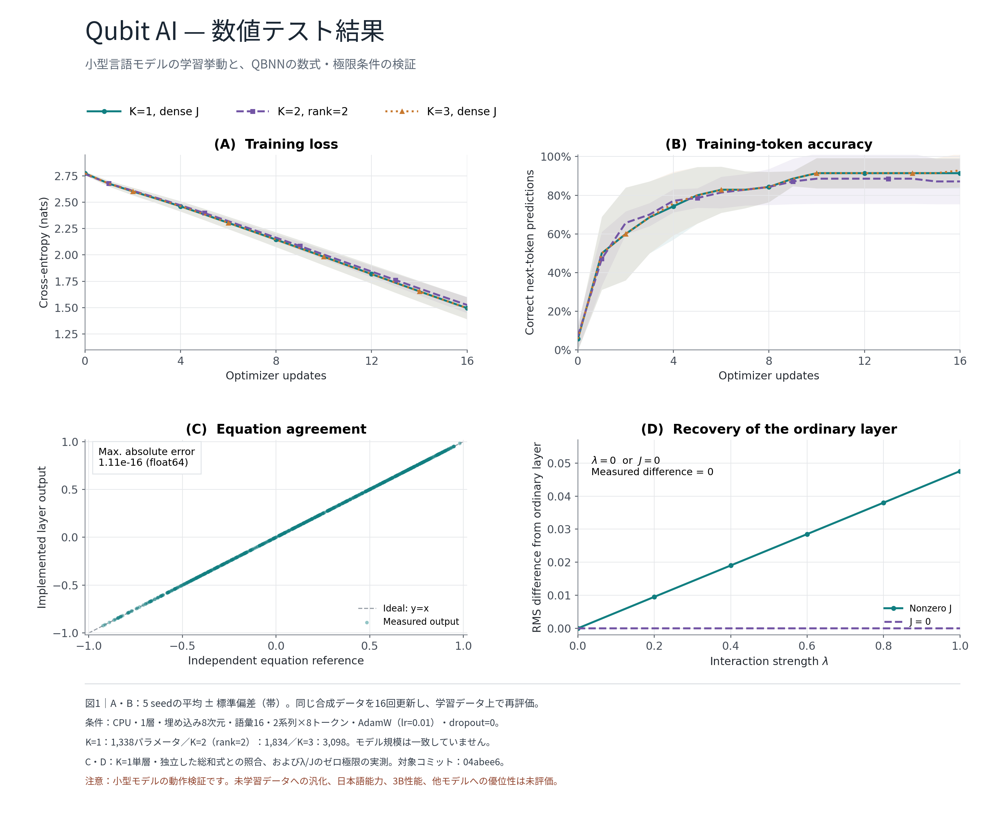

# Qubit AI

## 量子ビットに着想を得た、次世代のAI

Qubit AIは、**量子ビットの考え方とニューラルネットワークを組み合わせた量子インスパイアAI**です。

統計的な相関、量子状態の重ね合わせ、AIの確率的な振る舞いを、ひとつの計算モデルとして扱うことを目指しています。Qubit AIの中核には、調整可能擬似量子ビット（**APQB: Adjustable Pseudo Quantum Bit**）と、それをニューラルネットワークへ応用した**QBNN**があります。

> Qubit AIは、量子コンピュータ上で動作するAIではありません。  
> 古典コンピュータ上で、量子ビットや量子もつれから着想を得た計算構造を実装するAIです。

---

## Qubit AIのビジョン

現在のAIは、正確な回答と創造的な回答のバランスを、主にtemperatureなどの外部パラメータで調整します。

Qubit AIは、この「確定性」と「ゆらぎ」の関係を、モデル内部の状態として捉えます。

- 高い確信度：安定した、再現性の高い判断
- 高いゆらぎ：多様で、創造的な探索
- 状況に応じた調整：正確さと柔軟性の両立

Qubit AIが目指すのは、単にランダムな出力を生成することではありません。**文脈に応じて、慎重にも大胆にも振る舞えるAI**です。

---

## APQB：Qubit AIの基本単位

APQBは、内部角度 θ によって状態を連続的に調整する計算モデルです。

~~~text
|ψ⟩ = cosθ|0⟩ + sinθ|1⟩
~~~

APQBでは、統計的な相関 r とAIのゆらぎ T を次のように表します。

~~~text
r = cos(2θ)
T = |sin(2θ)|
r² + T² = 1
~~~

この関係は、確信度とゆらぎが独立ではなく、ひとつの状態空間の中で連続的に変化することを表します。

| 概念 | Qubit AIでの意味 |
| :--- | :--- |
| θ | AI内部状態を調整するパラメータ |
| r | 相関・確信度の指標 |
| T | ゆらぎ・探索性の指標 |
| 0状態・1状態 | 二つの基本状態 |
| 重ね合わせ | 複数の可能性を保持する状態 |

---

## QBNN：APQBを利用したニューラルネットワーク

QBNN（APQB Neural Network）は、通常のニューラルネットワークに、量子もつれに着想を得た層間相互作用を加えたアーキテクチャです。

~~~text
入力
  ↓
線形変換
  ↓
APQB状態の推定
  ↓
層間の相関・もつれ相互作用
  ↓
活性化
  ↓
次の層
~~~

一般的なニューラルネットワークが重み行列による線形結合を中心に構成されるのに対し、QBNNでは次の二つの結合を組み合わせます。

1. **古典的な線形結合**：重み行列によって情報を伝達します。
2. **量子インスパイア相関結合**：層と層の状態の関係を、学習可能な相互作用として表現します。

もつれ相互作用をゼロにすると通常のニューラルネットワークに近づくため、QBNNは古典的なニューラルネットワークを含む拡張モデルとして設計されています。

---

## Qubit AIが目指す能力

### 1. 確信度と創造性の調整

質問への回答では確定性を高め、アイデア生成では探索性を高めるなど、タスクに応じた振る舞いを目指します。

### 2. 相関を利用した文脈理解

単語や特徴を個別に処理するだけでなく、層間・特徴間の相関を利用して、文脈的な情報処理を行います。

### 3. 日本語を中心とした生成

日本語の文章理解・生成を重視し、将来的には英語やコードを含む多言語処理にも対応します。

### 4. ローカル・クラウド両対応

PyTorchによる学習・推論に加え、将来的には量子化モデルやGGUF形式を通じたローカル実行を目指します。

### 5. AIエージェントへの応用

Qubit AIを判断・計画・探索の中核として利用し、ツール実行や役割分担を行うAIエージェントへの発展を目指します。

---

## 現在のモデル

現在は、QBNNを基盤とする独自モデルを開発しています。

| 項目 | 内容 |
| :--- | :--- |
| モデル名 | Qubit AI / NeuroQ |
| アーキテクチャ | NeuroQuantum Transformer |
| 設計規模 | 約3Bパラメータ |
| 語彙数 | 32,000 |
| 埋め込み次元 | 2,560 |
| 隠れ次元 | 6,912 |
| 層数 | 26 |
| ヘッド数 | 20 |
| 主な学習対象 | 日本語、一般知識、指示、会話、数学、コード |

※ 3Bはモデル設計上の目標規模です。実際の性能は、学習データ、学習量、最適化、評価方法によって変化します。

---

## 数学的な考え方

Qubit AIでは、ニューラルネットワークにおける特徴間の相互作用と、APQBにおける多体相関を同じ構造として捉えます。

~~~text
ニューラルネットワーク：
f(x) = w₀ + Σᵢwᵢxᵢ + Σᵢⱼwᵢⱼxᵢxⱼ + …

APQB：
F(θ) = A₁z + A₂z² + A₃z³ + …
z = e^(i2θ)
~~~

この対応を利用し、ニューラルネットワークの特徴表現に、相関・重ね合わせ・ゆらぎという量子インスパイアの視点を導入します。

---

## 使い方

### Python

~~~bash
git clone https://github.com/tapiocaTakeshi/Qubit.git
cd Qubit
pip install -r requirements.txt
~~~

RunPodでのサーバーレス利用では、ハンドラーへ次のような入力を送信します。

~~~json
{
  "input": {
    "action": "inference",
    "prompt": "Qubit AIとは何ですか？"
  }
}
~~~

学習機能では、Qubit独自のモデルを日本語データセット、指示データ、会話データ、数学・コードデータへ段階的に適応させる構成を採用しています。

### TypeScript / JavaScript

~~~bash
npm install qubit_ai
~~~

~~~typescript
import { QubitAI } from "qubit_ai";

const qubit = new QubitAI({
  productName: "Qubit AI",
  enableLogging: true
});

const result = await qubit.judge(
  "ユーザーデータを外部へ送信する",
  "本番環境"
);

console.log(result.decision);
console.log(result.reasoning);
~~~

---

## 研究上の位置付け

Qubit AIは、量子コンピュータを使用した実装ではなく、量子力学の概念を計算モデルへ応用する**量子インスパイア研究**です。

APQBおよびQBNNの理論は、次のテーマを扱います。

- 相関と確率的挙動の統一
- 量子状態とAIのtemperatureの対応
- 多体相関とニューラルネットワークの構造
- 量子もつれに着想を得た層間相互作用
- 確信度と創造性のトレードオフ
- AIエージェントの計画・判断への応用

理論の詳細は、リポジトリ内の実装・ドキュメントおよびAPQB/QBNNに関する研究資料を参照してください。

---

## 数値テストによる検証

小型設定（1層・埋め込み8次元・語彙16・AdamW）でのQBNN実装の数値テスト結果です。

- **(A)(B) 学習挙動**：K=1（密なJ）、K=2（rank=2）、K=3（密なJ）の3設定で、5 seedの平均±標準偏差を計測。学習損失は単調に減少し、学習トークン精度は約90%まで到達（同じ合成データを16回更新し、学習データ上で再評価）。
- **(C) 数式との一致**：実装したQBNN層の出力を、独立に導出した総和式と照合。最大絶対誤差は1.11e-16（float64の丸め誤差の範囲内）で、実装が数式どおりに動作することを確認。
- **(D) 通常層への回帰**：相互作用強度λまたは結合Jをゼロにすると、QBNN層の出力は通常の（量子インスパイアでない）層と完全に一致（差分=0）することを実測で確認。

※ これは小型モデルでの実装の動作検証です。未学習データへの汎化性能、日本語能力、約3Bモデルでの性能、他モデルとの比較優位性については、これらのテストでは評価していません。

---

## ロードマップ

- [x] APQBの基本モデルを定式化
- [x] QBNNのプロトタイプを実装
- [x] RunPodでの学習基盤を構築
- [ ] 約3Bモデルの学習を安定化
- [ ] 日本語データセットによる段階学習
- [ ] 数学・コード能力の強化
- [ ] 評価ベンチマークの整備
- [ ] GGUF量子化とローカル推論
- [ ] Qubit Agentへの統合
- [ ] Qubit AI Web / Orchestraとの連携

---

## 注意事項

Qubit AIは研究・開発中のプロジェクトです。

- 「量子ビット」は量子インスパイアな計算概念として使用しています
- 量子コンピュータ上での量子優位性を主張するものではありません
- APQB/QBNNの有効性は、今後の実験とベンチマークによって検証します
- 学習済みモデルの品質は、学習データと学習条件に依存します

---

## License

MIT License

Copyright (c) tapiocaTakeshi

---

## TypeSafe AI Jevによる判断レイヤー

Qubit AIは、TypeSafe AIのJevをチャット生成モデルとしてではなく、回答評価・再試行判断・エージェント分岐を行う型付き判断レイヤーとして利用できます。

### サーバー設定

RunPodワーカーの環境変数に次を設定します。

~~~bash
TYPESAFE_JEV_URL=https://<your-typesafe-endpoint>
TYPESAFE_API_KEY=<your-typesafe-api-key>
TYPESAFE_JEV_MODEL=jev
TYPESAFE_JEV_TIMEOUT=20
~~~

APIキーはクライアントへ渡さず、RunPodワーカー側だけに設定してください。

### RunPodリクエスト

~~~json
{
  "input": {
    "action": "jev_judge",
    "prompt": "ユーザーの質問に対するQubit AIの回答です。",
    "parameters": {
      "labels": ["answer", "needs_retry", "needs_tool"],
      "instruction": "この回答が質問に適切か判断してください。"
    }
  }
}
~~~

返却値はJevの判断結果を `decision` に格納します。Qubit AIの生成処理と分離しているため、Jevが未設定でも通常の推論は動作します。TypeSafe AIの実際のAPI URLとレスポンス形式に合わせて、`TYPESAFE_JEV_URL`を設定してください。
