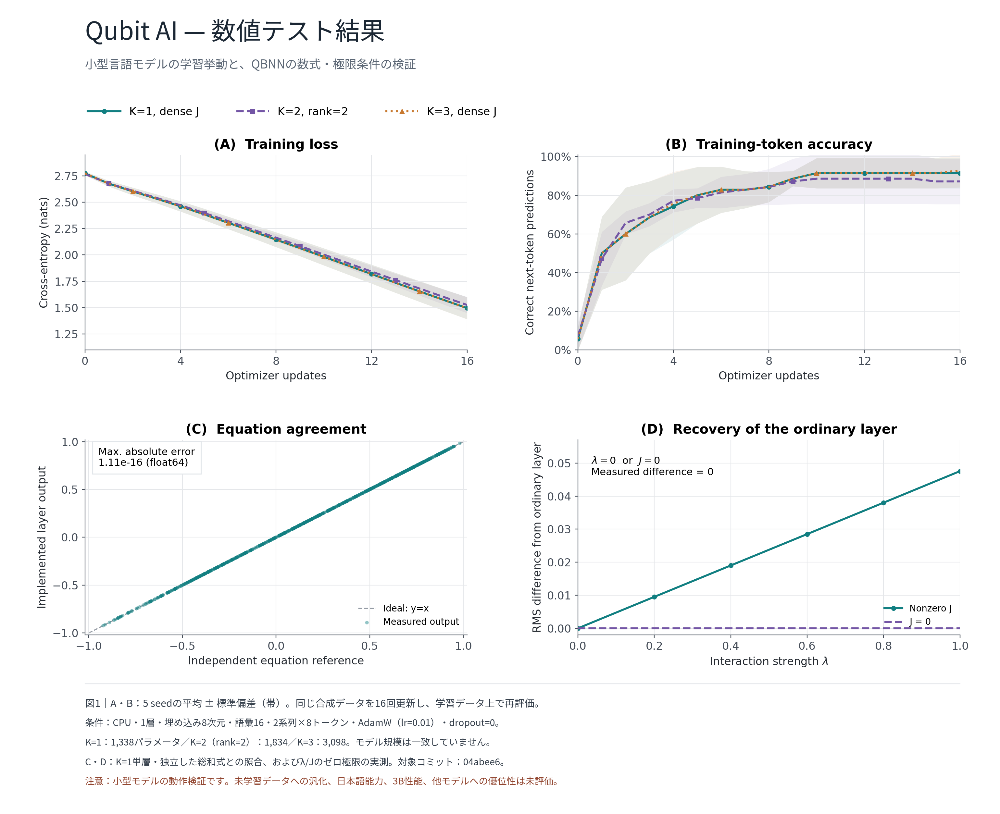

# Qubit AI

## 量子ビットに着想を得た、次世代のAI

Qubit AIは、**量子ビットの考え方とニューラルネットワークを組み合わせた量子インスパイアAI**です。

統計的な相関、量子状態の重ね合わせ、AIの確率的な振る舞いを、ひとつの計算モデルとして扱うことを目指しています。Qubit AIの中核には、調整可能擬似量子ビット（**APQB: Adjustable Pseudo Quantum Bit**）と、それをニューラルネットワークへ応用した**QBNN**があります。

> Qubit AIは、量子コンピュータ上で動作するAIではありません。  
> 古典コンピュータ上で、量子ビットや量子もつれから着想を得た計算構造を実装するAIです。

---

## Qubit AIのビジョン

現在のAIは、正確な回答と創造的な回答のバランスを、主にtemperatureなどの外部パラメータで調整します。

Qubit AIは、この「確定性」と「ゆらぎ」の関係を、モデル内部の状態として捉えます。

- 高い確信度：安定した、再現性の高い判断
- 高いゆらぎ：多様で、創造的な探索
- 状況に応じた調整：正確さと柔軟性の両立

Qubit AIが目指すのは、単にランダムな出力を生成することではありません。**文脈に応じて、慎重にも大胆にも振る舞えるAI**です。

---

## APQB：Qubit AIの基本単位

APQBは、内部角度 θ によって状態を連続的に調整する計算モデルです。

~~~text
|ψ⟩ = cosθ|0⟩ + sinθ|1⟩
~~~

APQBでは、相関 r ∈ [−1, 1] から角度 θ と補助座標 q を作ります（「APQB/QBNN 改訂版」論文（2026年10月9日）式(1)–(2)。以下、式番号は同論文、参照実装は `apqb_qbnn_v2.py`）。

~~~text
θ = ½·arccos r      (0 ≤ θ ≤ π/2)
r = cos(2θ) = ⟨Z⟩
q = sin(2θ) = √(1 − r²) = ⟨X⟩   （旧稿の T）
r² + q² = 1
~~~

r と q は単位円 r² + q² = 1 の上を連続的に動きます。q はこの状態族のコヒーレンス座標であり、AIのtemperatureそのものではありません。

| 概念 | Qubit AIでの意味 |
| :--- | :--- |
| θ | AI内部状態を調整するパラメータ |
| r | 相関（Z期待値）。確信度として使う場合は校正データとの対応を別途定義 |
| q（旧T） | コヒーレンス座標（温度そのものではない）。論文では温度を校正式 τ_AI = τ_min + (τ_max − τ_min)·q̄^γ（式(18)、参照実装 `apqb_qbnn_v2.calibrated_temperature`）で定義。現行の生成コード（`neuroquantum_layered.py`）はステップ依存の正弦スケジュールを使い、q からは計算していない |
| 0状態・1状態 | 二つの基本状態 |
| 重ね合わせ | 複数の可能性を保持する状態 |

---

## QBNN：APQBを利用したニューラルネットワーク

QBNN（APQB Neural Network）は、通常のアフィン経路に APQB の相関ゲートを掛け合わせる、検証可能な古典ニューラルネットワークです（式(13)–(14)、参照実装 `apqb_qbnn_v2.QBNNLayerV2`）。

~~~text
u = W h + b                         （通常の線形変換）
a = P h + c,  r = tanh a,  q = sech a   （APQB座標, r² + q² = 1）
c_r = J_rᵀ r,  c_q = J_qᵀ q
g = 1 + λ_r c_r + λ_q c_q           （相関ゲート）
h′ = σ(u ⊙ g)
~~~

1. **古典的な線形結合**：重み行列 W によって情報を伝達します。
2. **相関ゲート**：APQB 座標 (r, q) を学習可能な行列 J で混ぜ、出力を要素ごとに調整します。J は学習可能な古典的相互作用であり、物理的な量子もつれを実現する演算子ではありません。

J = 0 または λ = 0 のとき、出力は通常の層 σ(Wh + b) と厳密に一致します（命題4）。初期化では J = 0、λ を小さな非ゼロ値にするため、学習開始時は通常の層と同じ出力から相関経路の学習が始まります。層間に加算型の補正を加える旧稿の設計は比較用の設計候補です。なお、現行の生成モデル（`neuroquantum_layered.py` の `QBNNLayer`）と `qbnn_layered.py` は、この加算型の設計を使っています。

---

## Qubit AIが目指す能力

### 1. 確信度と創造性の調整

質問への回答では確定性を高め、アイデア生成では探索性を高めるなど、タスクに応じた振る舞いを目指します。

### 2. 相関を利用した文脈理解

単語や特徴を個別に処理するだけでなく、層間・特徴間の相関を利用して、文脈的な情報処理を行います。

### 3. 日本語を中心とした生成

日本語の文章理解・生成を重視し、将来的には英語やコードを含む多言語処理にも対応します。

### 4. ローカル・クラウド両対応

PyTorchによる学習・推論に加え、将来的には量子化モデルやGGUF形式を通じたローカル実行を目指します。

### 5. AIエージェントへの応用

Qubit AIを判断・計画・探索の中核として利用し、ツール実行や役割分担を行うAIエージェントへの発展を目指します。

---

## 現在のモデル

現在は、QBNNを基盤とする独自モデルを開発しています。

| 項目 | 内容 |
| :--- | :--- |
| モデル名 | Qubit AI / NeuroQ |
| アーキテクチャ | NeuroQuantum Transformer |
| 設計規模 | 約3Bパラメータ |
| 語彙数 | 32,000 |
| 埋め込み次元 | 2,560 |
| 隠れ次元 | 6,912 |
| 層数 | 26 |
| ヘッド数 | 20 |
| 主な学習対象 | 日本語、一般知識、指示、会話、数学、コード |

※ 3Bはモデル設計上の目標規模です。実際の性能は、学習データ、学習量、最適化、評価方法によって変化します。

---

## 数学的な考え方

活性化を持たない全結合層はアフィン変換の合成であり、高次の交互作用項が自動的に現れるわけではありません。APQBとニューラルネットワークの対応は、次の限定された範囲で扱います（同論文 第4章）。

~~~text
ブール入力 x ∈ {−1,+1}ᵈ：
f(x) = Σ_{S⊆{1..d}} f̂(S) ∏_{i∈S} xᵢ      （2ᵈ 個の直交基底で一意に展開, 式(10)）

独立な APQB 座標 zᵢ = rᵢ + i qᵢ の部分集合積：
Φ_S(z) = ∏_{i∈S} zᵢ                       （rᵢ = xᵢ, qᵢ = 0 で上の基底と一致, 式(12)）
~~~

一変数の F = Σ_k A_k zᵏ（z = e^(i2θ)）は次数 K で K+1 個の係数しか持たず、n 変数の 2ⁿ 個の係数とは同一視しません。一般のニューラルネットワークとの同型性も主張しません。

この限定された対応を利用し、ニューラルネットワークの特徴表現に、相関・重ね合わせ・ゆらぎという量子インスパイアの視点を導入します。

---

## 使い方

### Python

~~~bash
git clone https://github.com/tapiocaTakeshi/Qubit.git
cd Qubit
pip install -r requirements.txt
~~~

RunPodでのサーバーレス利用では、ハンドラーへ次のような入力を送信します。

~~~json
{
  "input": {
    "action": "inference",
    "prompt": "Qubit AIとは何ですか？"
  }
}
~~~

学習機能では、Qubit独自のモデルを日本語データセット、指示データ、会話データ、数学・コードデータへ段階的に適応させる構成を採用しています。

### TypeScript / JavaScript

~~~bash
npm install qubit_ai
~~~

~~~typescript
import { QubitAI } from "qubit_ai";

const qubit = new QubitAI({
  productName: "Qubit AI",
  enableLogging: true
});

const result = await qubit.judge(
  "ユーザーデータを外部へ送信する",
  "本番環境"
);

console.log(result.decision);
console.log(result.reasoning);
~~~

---

## 研究上の位置付け

Qubit AIは、量子コンピュータを使用した実装ではなく、量子力学の概念を計算モデルへ応用する**量子インスパイア研究**です。

APQBおよびQBNNの理論は、次のテーマを扱います。

- 相関と確率的挙動の統一
- コヒーレンス座標 q から AI 温度への校正写像（式(18)）
- ブール基底・部分集合積とニューラルネットワーク特徴の限定的な対応
- 量子もつれに着想を得た層間相互作用
- 確信度と創造性のトレードオフ
- AIエージェントの計画・判断への応用

理論の詳細は、リポジトリ内の実装・ドキュメントおよびAPQB/QBNNに関する研究資料を参照してください。

---

## 数値テストによる検証

小型設定（1層・埋め込み8次元・語彙16・AdamW）でのQBNN実装の数値テスト結果です。

- **(A)(B) 学習挙動**：K=1（密なJ）、K=2（rank=2）、K=3（密なJ）の3設定で、5 seedの平均±標準偏差を計測。学習損失は単調に減少し、学習トークン精度は約90%まで到達（同じ合成データを16回更新し、学習データ上で再評価）。
- **(C) 数式との一致**：実装したQBNN層の出力を、独立に導出した総和式と照合。最大絶対誤差は1.11e-16（float64の丸め誤差の範囲内）で、実装が数式どおりに動作することを確認。
- **(D) 通常層への回帰**：相互作用強度λまたは結合Jをゼロにすると、QBNN層の出力は通常の（量子インスパイアでない）層と完全に一致（差分=0）することを実測で確認。

※ これは小型モデルでの実装の動作検証です。未学習データへの汎化性能、日本語能力、約3Bモデルでの性能、他モデルとの比較優位性については、これらのテストでは評価していません。

---

## ロードマップ

- [x] APQBの基本モデルを定式化
- [x] QBNNのプロトタイプを実装
- [x] RunPodでの学習基盤を構築
- [ ] 約3Bモデルの学習を安定化
- [ ] 日本語データセットによる段階学習
- [ ] 数学・コード能力の強化
- [ ] 評価ベンチマークの整備
- [ ] GGUF量子化とローカル推論
- [ ] Qubit Agentへの統合
- [ ] Qubit AI Web / Orchestraとの連携

---

## 注意事項

Qubit AIは研究・開発中のプロジェクトです。

- 「量子ビット」は量子インスパイアな計算概念として使用しています
- 量子コンピュータ上での量子優位性を主張するものではありません
- APQB/QBNNの有効性は、今後の実験とベンチマークによって検証します
- 学習済みモデルの品質は、学習データと学習条件に依存します

---

## License

MIT License

Copyright (c) tapiocaTakeshi

---

## TypeSafe AI Jevによる判断レイヤー

Qubit AIは、TypeSafe AIのJevをチャット生成モデルとしてではなく、回答評価・再試行判断・エージェント分岐を行う型付き判断レイヤーとして利用できます。

### サーバー設定

RunPodワーカーの環境変数に次を設定します。

~~~bash
TYPESAFE_JEV_URL=https://<your-typesafe-endpoint>
TYPESAFE_API_KEY=<your-typesafe-api-key>
TYPESAFE_JEV_MODEL=jev
TYPESAFE_JEV_TIMEOUT=20
~~~

APIキーはクライアントへ渡さず、RunPodワーカー側だけに設定してください。

### RunPodリクエスト

~~~json
{
  "input": {
    "action": "jev_judge",
    "prompt": "ユーザーの質問に対するQubit AIの回答です。",
    "parameters": {
      "labels": ["answer", "needs_retry", "needs_tool"],
      "instruction": "この回答が質問に適切か判断してください。"
    }
  }
}
~~~

返却値はJevの判断結果を `decision` に格納します。Qubit AIの生成処理と分離しているため、Jevが未設定でも通常の推論は動作します。TypeSafe AIの実際のAPI URLとレスポンス形式に合わせて、`TYPESAFE_JEV_URL`を設定してください。
